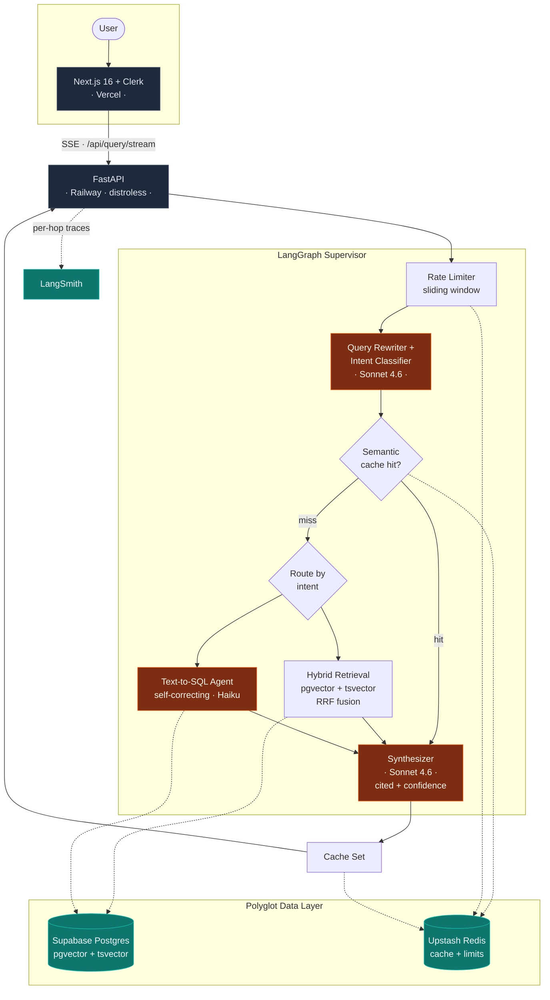
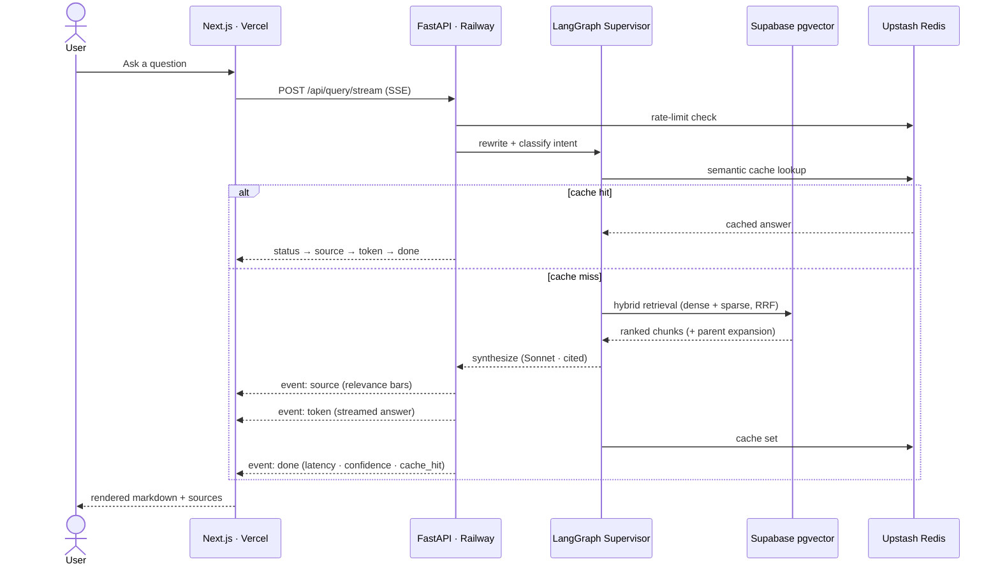
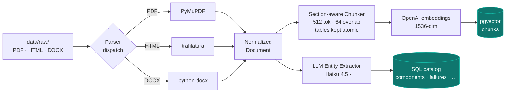

<div align="center">

# Harness Engineering RAG

### Agentic retrieval-augmented generation over the harness-engineering corpus

Hybrid retrieval · text-to-SQL · semantic caching · per-hop tracing — a production-grade agentic architecture at MVP scale.

<br/>


<br/>

**[▶ Live Demo](https://harness-engineering-rag.vercel.app)** &nbsp;·&nbsp; **[API Health](https://harness-engineering-rag-production.up.railway.app/api/health)** &nbsp;·&nbsp; **[Architecture](#-architecture)** &nbsp;·&nbsp; **[ADRs](#-architecture-decisions)**

</div>

---

<div align="center">



<sub>For an even stronger first impression, record a 10–15 s clip of the live app (sign in → ask → streaming cited answer → repeat for a cache hit), save it as <code>docs/assets/demo.gif</code>, and swap the image above to <code>docs/assets/demo.gif</code>. Tools: <a href="https://getkap.co/">Kap</a>, <a href="https://www.cockos.com/licecap/">LICEcap</a>, or <code>peek</code>.</sub>

</div>

---

## What this is

A natural-language interface over a curated corpus of harness-engineering literature (Trivedy, Osmani, Anthropic Labs, HumanLayer, Red Hat) plus a practitioner case study mapping those principles to a production enterprise RAG system. Queries flow through a **LangGraph supervisor** that routes to specialized workers — hybrid retrieval over pgvector, text-to-SQL over a structured catalog, or both in parallel — then synthesizes **cited answers with confidence scoring**, streamed token-by-token over SSE.

Built as a portfolio MVP demonstrating the full production architecture at reduced scale. Every architectural decision is documented in [`docs/adr/`](docs/adr/).

---

## At a glance

| Metric | Value |
|---|---|
| **Corpus** | 7 documents across 3 formats (PDF · HTML · DOCX) |
| **Chunks in pgvector** | 420 |
| **Structured catalog** | 108 components · 43 failure modes · 14 harnesses · 7 practitioners · 9 benchmarks |
| **Retrieval** | Hybrid dense + sparse with reciprocal rank fusion, parent-chunk expansion |
| **Cache** | Semantic similarity (cosine ≥ 0.92) — **sub-1.2 s on hit** vs ~28 s cold |
| **Routing** | 7/7 correct on integration test (retrieval · SQL · hybrid · direct · cross-doc · DOCX · cache) |
| **Cost / query** | ~₹1.5 blended (Haiku workers + Sonnet synthesis + prompt caching) |
| **Backend image** | 314 MB distroless, runtime deps only |

---

## 🏗 Architecture



### Query lifecycle (streaming)



The SSE wire protocol emits five event kinds — `status`, `source`, `token`, `done`, `error` — consumed by the frontend parser in [`frontend/src/lib/api.ts`](frontend/src/lib/api.ts).

---

## 📥 Dual-extraction ingestion

The pipeline reads each document **once** and produces **two** outputs — vector chunks and structured catalog rows — so the same corpus serves both semantic retrieval and text-to-SQL.



Every catalog row carries `source_doc_id` provenance. Parser selection: Docling and `unstructured` were evaluated and rejected — their PyTorch/layout-model dependencies (~4 GB) weren't justified for this born-digital corpus. See [`docs/adr/001-parser-selection.md`](docs/adr/001-parser-selection.md).

---

## 🧰 Tech stack

| Layer | Technology |
|---|---|
| Orchestration | LangGraph (StateGraph with conditional routing) |
| Models | Claude **Sonnet 4.6** (planner + synthesizer), **Haiku 4.5** (workers) |
| Embeddings | OpenAI `text-embedding-3-small` (1536-dim) |
| Vector store | Supabase Postgres + pgvector (HNSW index) |
| Sparse retrieval | Postgres `tsvector` + `ts_rank_cd` |
| Structured data | 6 catalog tables for the text-to-SQL agent |
| Cache | Upstash Redis (semantic similarity + sliding-window rate limiter) |
| Backend | FastAPI (async, SSE streaming; Mangum for the Lambda path) |
| Frontend | Next.js 16, Tailwind v4, Clerk auth |
| Observability | LangSmith per-hop tracing, token tracking |
| Container | Multi-stage distroless image (314 MB, runtime deps only) |
| CI | GitHub Actions with RAGAS eval gates |
| IaC | Terraform modules for AWS Lambda + API Gateway ([`infra/`](infra/)) |
| Packaging | `uv` with committed lockfile |

---

## 📚 Corpus

| # | Document | Format | Author |
|---|---|---|---|
| 1 | Agent Harness Engineering | PDF | Addy Osmani |
| 2 | Self-Improving Coding Agents | PDF | Addy Osmani |
| 3 | Harness Design for Long-Running Development | PDF | Anthropic (Prithvi Rajasekaran) |
| 4 | Skill Issue: Harness Engineering for Coding Agents | PDF | HumanLayer (Kyle) |
| 5 | The Anatomy of an Agent Harness | PDF | Viv Trivedy |
| 6 | Structured Workflows for AI-Assisted Development | HTML | Red Hat Developer |
| 7 | Harness Engineering Applied to Production Enterprise RAG | DOCX | Sunil Maharana |

---

## ▶️ Demo queries

| Query | Path | What it demonstrates |
|---|---|---|
| "What is a harness?" | Retrieval | Core definition with source citations |
| "List all components in the safety category" | SQL | Text-to-SQL over the catalog |
| "What failure modes do hooks address?" | Hybrid | Retrieval + SQL fused |
| "How does Red Hat's workflow relate to Anthropic's planner/evaluator?" | Cross-doc | Synthesis across articles |
| "How are harness principles applied in manufacturing?" | DOCX | Surfaces the practitioner case study |
| _Repeat any query_ | Cache hit | Sub-1.2 s semantic cache + hit indicator |

---

## 🚀 Quickstart

```bash
git clone https://github.com/maharanasunil1843/harness-engineering-rag.git
cd harness-engineering-rag

# Backend
cp .env.example .env          # fill in API keys
uv sync
make ingest
make smoke
uv run uvicorn app.api.main:app --reload --port 8000

# Frontend (separate terminal)
cd frontend
cp .env.local.example .env.local   # fill in Clerk keys
npm install && npm run dev

# Open http://localhost:3000
```

---

## ☁️ Live deployment (Vercel + Railway)

Frontend on **Vercel**, backend on **Railway** (long-lived container), data layer unchanged (Supabase + Upstash). Both platforms auto-deploy on push to `main` via their native Git integrations — there is no GitHub Actions deploy job.

> Why Railway over the documented Lambda path? API Gateway buffers responses and **cannot stream SSE**, which the chat depends on. See [`docs/adr/004-railway-over-lambda.md`](docs/adr/004-railway-over-lambda.md).

**Deploy order matters** — stand up the backend first so its URL is available for the frontend's `NEXT_PUBLIC_API_URL`.

### 1. Backend → Railway

New Project → *Deploy from GitHub repo*. Railway builds the root [`Dockerfile`](Dockerfile) (config in [`railway.json`](railway.json), healthcheck `/api/health`). Set:

| Variable | Source |
|---|---|
| `ANTHROPIC_API_KEY`, `OPENAI_API_KEY` | model providers |
| `DATABASE_URL` | Supabase session-pooler connection string |
| `SUPABASE_URL`, `SUPABASE_ANON_KEY` | Supabase project |
| `UPSTASH_REDIS_REST_URL`, `UPSTASH_REDIS_REST_TOKEN` | Upstash Redis |
| `LANGSMITH_API_KEY` | LangSmith (or set `LANGSMITH_TRACING=false`) |
| `ADMIN_KEY` | optional; gates `/api/metrics` |

> Railway injects `PORT`; the distroless entrypoint [`serve.py`](serve.py) reads it. Set the public networking port to match (`8080`). The image carries **no shell**, so the start command is the Dockerfile `CMD` — do not add a `startCommand` to `railway.json`.

### 2. Frontend → Vercel

Import the repo, set **Root Directory** to `frontend`, and add:

| Variable | Value |
|---|---|
| `NEXT_PUBLIC_API_URL` | the Railway URL (no trailing slash) |
| `NEXT_PUBLIC_CLERK_PUBLISHABLE_KEY`, `CLERK_SECRET_KEY` | Clerk |
| `NEXT_PUBLIC_CLERK_SIGN_IN_URL`, `NEXT_PUBLIC_CLERK_SIGN_UP_URL` | `/sign-in`, `/sign-up` |

CORS already allows `*.vercel.app` ([`app/api/middleware.py`](app/api/middleware.py)); the browser streams SSE directly from Railway, so Vercel's serverless response limits don't apply. A Clerk **development** instance accepts any origin — no domain registration needed for the demo.

---

## ✅ Evaluation

```bash
make eval        # full 20-query RAGAS eval
make eval-quick  # first 5 queries only
```

CI blocks merge if **RAGAS faithfulness drops below 0.85**. See [`.github/workflows/eval.yml`](.github/workflows/eval.yml).

---

## 🗂 Project structure

```
├── app/
│   ├── agents/         # LangGraph supervisor, query rewriter, synthesizer
│   ├── retrieval/      # Hybrid retrieval, semantic cache, rate limiter
│   ├── sql/            # Text-to-SQL agent with self-correction
│   ├── observability/  # LangSmith tracing, token tracking
│   └── api/            # FastAPI routes, SSE streaming, Lambda handler
├── ingestion/          # Parser dispatcher, chunker, embedder, entity extractor
├── evals/              # RAGAS golden set and evaluation harness
├── frontend/           # Next.js 16 + Clerk + Tailwind v4 (+ /showcase hero)
├── infra/terraform/    # AWS Lambda + API Gateway IaC
├── scripts/            # Smoke test, integration tests, DB utilities
├── docs/adr/           # Architecture decision records
├── Dockerfile          # Multi-stage distroless backend image (Railway)
├── serve.py            # Shell-free container entrypoint ($PORT → uvicorn)
├── railway.json        # Railway build/deploy config
├── CLAUDE.md           # Agent harness configuration for this repo
└── Makefile
```

---

## 📐 Architecture decisions

| ADR | Decision |
|---|---|
| [001](docs/adr/001-parser-selection.md) | Format-specific parsers over Docling / unstructured |
| [002](docs/adr/002-datastore-choice.md) | Supabase for MVP, Neon for production serverless |
| [003](docs/adr/003-extraction-quality-bugs-and-fixes.md) | Heading-classifier ratchet, entity-quality validation |
| [004](docs/adr/004-railway-over-lambda.md) | Railway over Lambda for the MVP backend (SSE streaming) |

---

## 🛣 AWS production migration path

| MVP (current) | Production AWS |
|---|---|
| Supabase (pgvector) | RDS Postgres + Pinecone |
| Upstash Redis | ElastiCache |
| Vercel (frontend) | CloudFront + S3 |
| Railway (backend) | Lambda + API Gateway |
| Clerk | Cognito |

The Lambda handler (Mangum) and Terraform modules are included — migration is a configuration change, not a re-architecture.

---

## License

MIT
</content>
